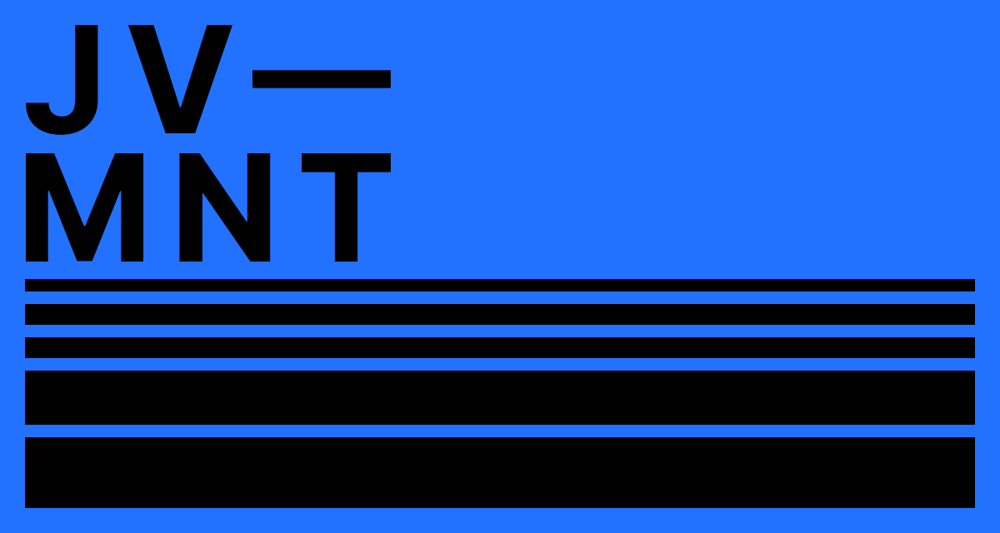

# jv-mnt

Este es mi blog personal construido con [AstroPaper](https://github.com/satnaing/astro-paper) y desplegado en Cloudflare.

## Tecnologías utilizadas

- [Astro](https://astro.build/)
- [Tailwind CSS](https://tailwindcss.com/)
- [Markdown](https://www.markdownguide.org/)
- [Cloudflare Pages](https://pages.cloudflare.com/)

## Instalación y uso

Si deseas ejecutar este blog en local, sigue estos pasos:

1. Clona este repositorio:
   ```sh
   git clone https://github.com/tu-usuario/jv-mnt.git
   cd jv-mnt
   ```
2. Instala las dependencias:
   ```sh
   npm install
   ```
3. Inicia el servidor de desarrollo:
   ```sh
   npm run dev
   ```
4. Abre `http://localhost:4321` en tu navegador (puede variar según la configuración de Astro).

## Personalización

- La tipografía predeterminada es **Inter**, pero puedes cambiarla fácilmente editando los estilos en `src/styles`.
- Se pueden modificar otros aspectos visuales mediante Tailwind CSS.

## Licencia

Este proyecto está bajo la licencia MIT. Puedes usarlo y modificarlo libremente.

---

Si tienes dudas o sugerencias, ¡haz un issue o un fork! 🚀

